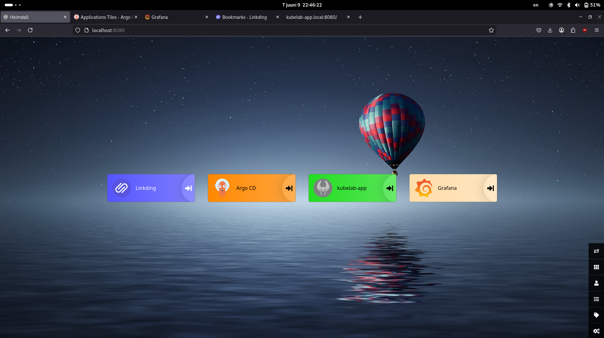
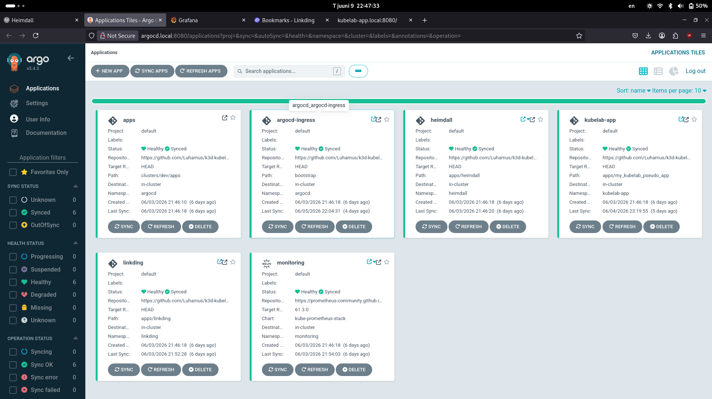
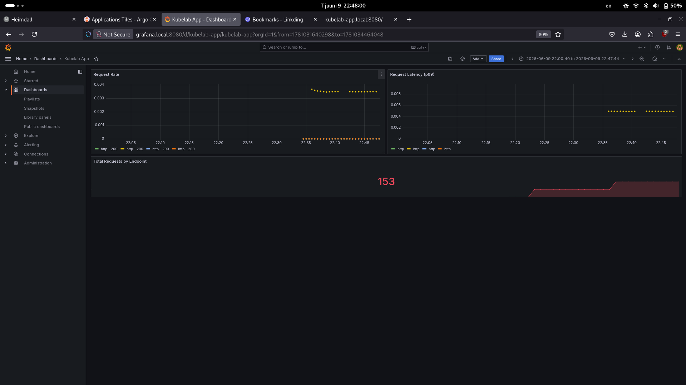
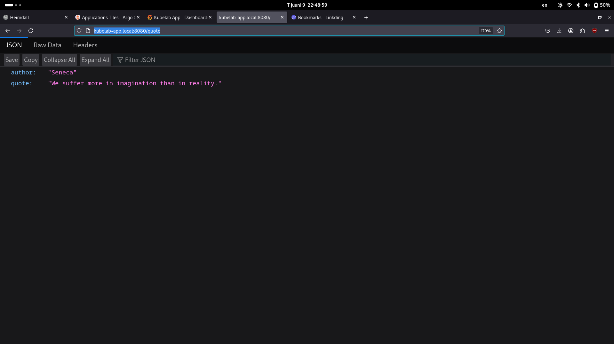

# k3d Kubelab
A local Kubernetes homelab running on `k3d`, built as a learning project.

## Stack
| Component | Purpose |
|-----------|---------|
| k3d + ingress-nginx | Local Kubernetes cluster with ingress |
| ArgoCD | GitOps — cluster state driven by Git |
| Heimdall | App dashboard |
| Linkding | Bookmark manager ( with default bookmarks ) |
| Prometheus + Grafana | Monitoring |
| kubelab-app | Custom Flask pseudoApp with Github CI/CD pipeline |

## Prerequisites
Following tools need to be installed and working:
- `docker`
- `kubectl`
- `helm` 
- `k3d` 

## Getting up and running
```bash
git clone https://github.com/Luhamus/k3d-kubelab.git
cd k3d-kubelab
bash setup_script.sh
```
update /etc/hosts accordingly ( see [Networking](#networking) )

---

### Networking
For me, using `Fedora`, i was not able to access internet from my k8s cluster initally.
`Docker` was looking for the DNS server at the Host's ip (127.0.0.53), which doesn't exist inside the cluster
The fix was adding DNS location explicitly in `/etc/docker/daemon.json`. 
```
{
  "dns": ["8.8.8.8", "1.1.1.1"],
   ...
```

For now, I added the apps to my `/etc/hosts` file for to open them easilly with browser:
```
127.0.0.1 localhost ... ... ... heimdall.local linkding.local argocd.local grafana.local prometheus.local
```


### Accessing Services

| Service | URL | Credentials |
|---------|-----|-------------|
| Heimdall | localhost:8080, http://heimdall.local:8080 | - |
| Linkding | http://linkding.local:8080 | admin / changeme |
| ArgoCD | http://argocd.local:8080 | see below |
| Grafana | http://grafana.local:8080 | admin / changeme |
| Prometheus | http://prometheus.local:8080 | - |
| Kubelab App | http://kubelab-app.local:8080 | - |


#### ArgoCD inital password
To get the initial generated password for ArgoCD (username is `admin`), run the following command:
```
k get -n argocd secrets argocd-initial-admin-secret -o jsonpath='{.data.password}' | base64 -d && echo
```

### Additional info
- Argocd HTTPS is diasbled and redirected to HTTP
- Kubelab-app has 3 endpoints: `/health`, `/metrics`  and `/quote`

## Screenshots
<p align="center">
  <a href="screenshots/heimdall_screenshot.png">
    
  </a>
  &nbsp;
  <a href="screenshots/argocd_screenshot.png.png">
    
  </a>
</p>

<p align="center">
  <a href="images/grafana_screenshot.png">
    
  </a>
  &nbsp;
  <a href="screenshots/kubelab_app_screenshot.png">
    
  </a>
</p>

